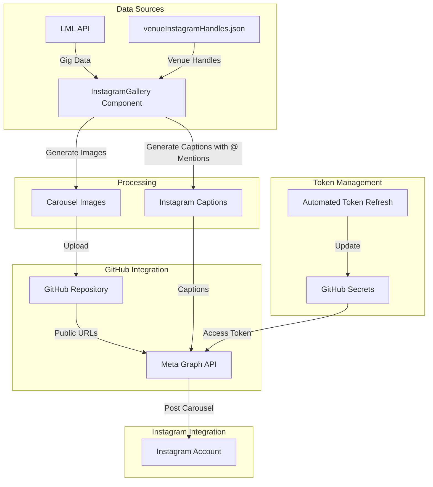
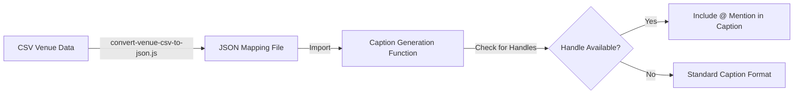
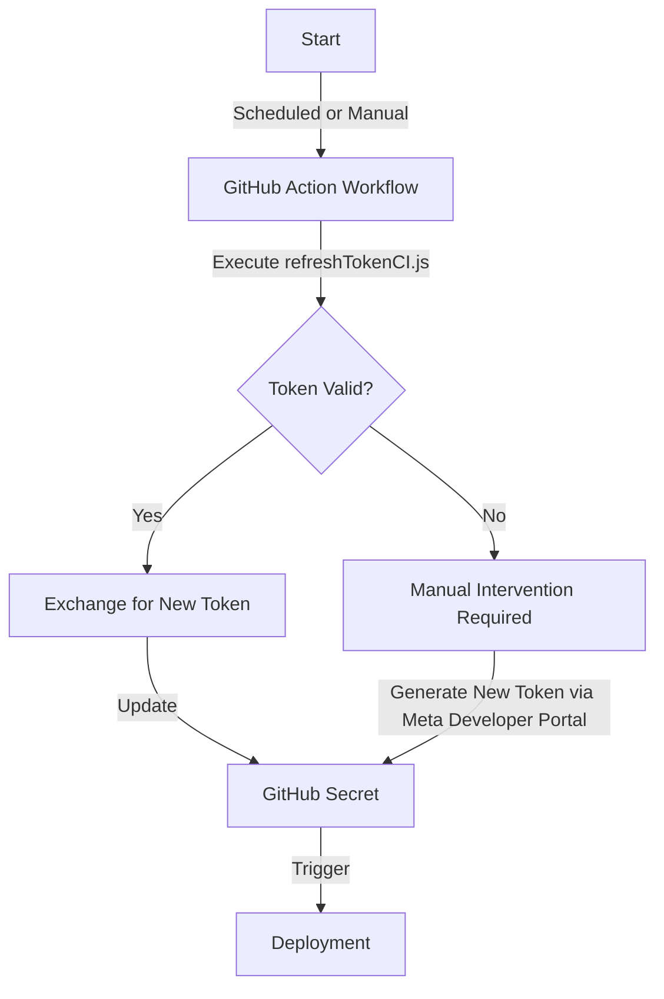
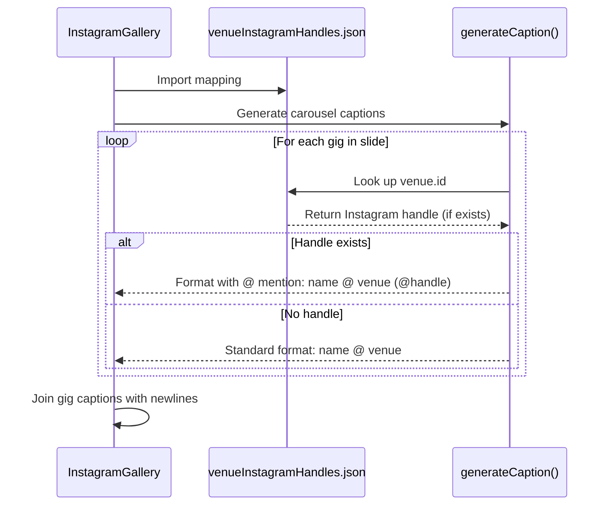

# Instagram Venue Handle Integration - System Diagram

The following diagrams illustrate the architecture and workflow of the Instagram venue handle integration system.

## System Components

## Venue Handle Mapping Process

## Token Refresh Workflow

## Caption Generation Logic

These diagrams provide a visual overview of the system architecture, data flow, and key processes involved in the Instagram venue handle integration.